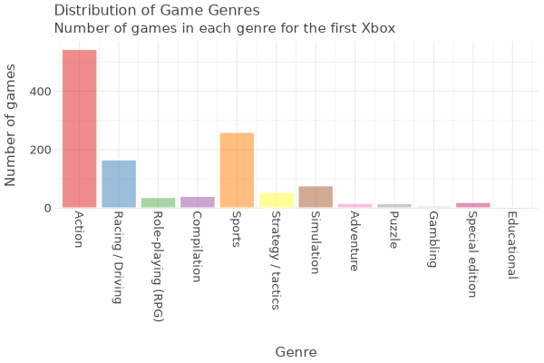
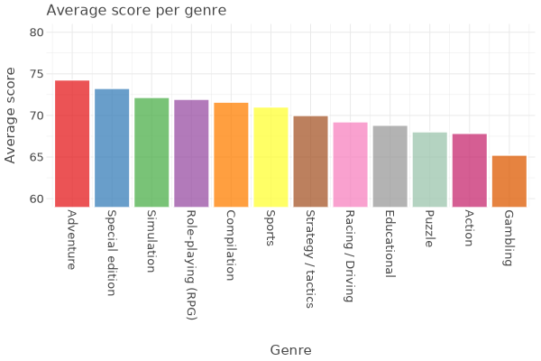
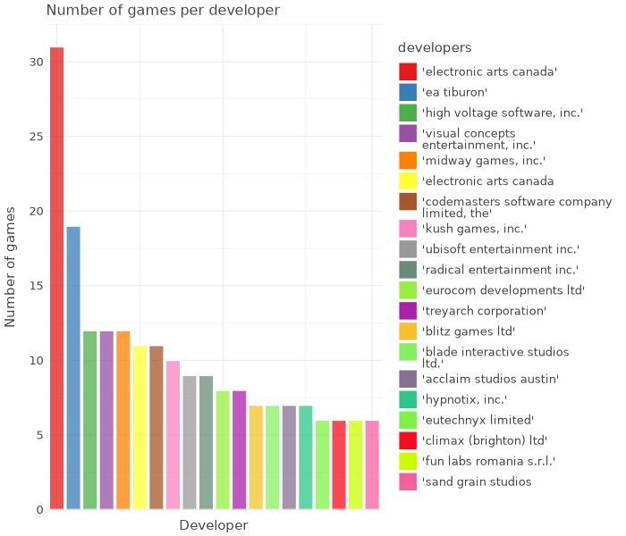
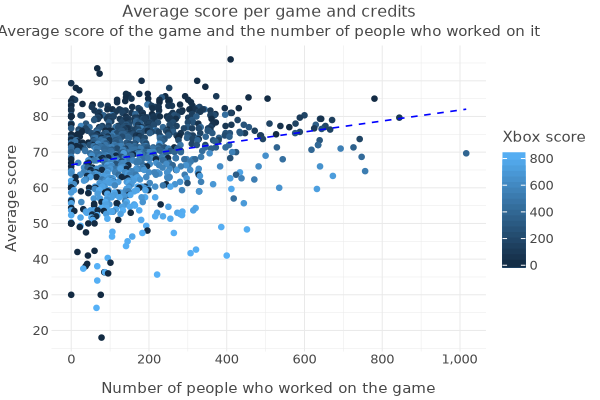
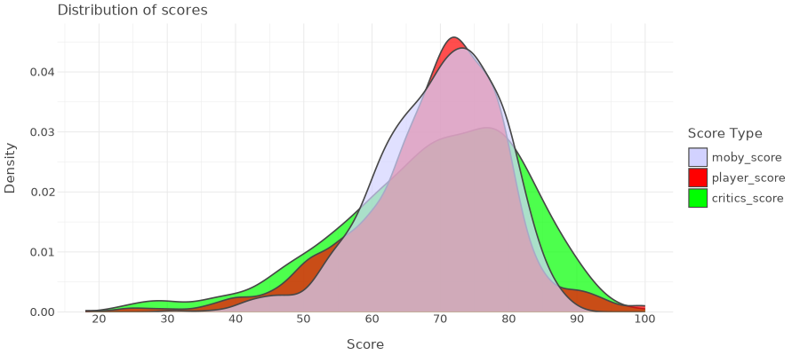

# Analysis of Data from MobyGames

### Introduction

I am an Econ student from IE univeristy and I created this for my final project for LSE Summer School ME204 course in July 2024

In this analysis, we explore the data from MobyGames, which is a comprehensive database of video games. We are specifically looking at games from the first Xbox to gain insight into the gamoing industry, such as which game genres were most popular and which developers dominated the games.

### Data Source

The data used in this analysis is from [MobyGames](https://www.mobygames.com/), which is a community-driven video game database which aims to preserve the history behind electronic gaming. The data used in this project contains the titles and links of everygame from the first Xbox, aswell as information regarding the release, genre, and scores for each game.

## Steps
1) Scrape the data from [MobyGames](https://www.mobygames.com/) using selenium and scrapy
2) Clean up the data using pandas
3) Add the data to a SQLite database
4) Analyse and graph the data using ggplot

## Data Analysis

### Game Genres

To understand the distribution of game genres, we performed a genre analysis. We calculated the frequency of each genre and visualized the results using a bar chart. The chart provides insights into the most popular genres in the MobyGames database. We found that the most common genre were Action games, over 540 games are action games, which is more than half since there are 1,017 games. Sport genre are second most common genre, with 260 games.

There are 12 different genres that Xbox games fall under

The average score for all the genres ranged between 74.3% and 65.2%. The genre with the highest average score is Adventure

### Developers

The games for the top 20 developers can be seen below, with electronic arts canada having developed the most amount of games with 31 games.

### Game scores

Lastly, we analyzed the average scores with relation to other variables

#### Score per Game and People Who Worked On It

The visual below shows a positive relationship between the number of people who worked on a game and the average score it got. There appears to be little no impact on the number of workers and the xbox score of the game  

#### Comparing score distrubition

The visual below shows the disttirbution of scores from 'moby_score', 'critics_score' and 'player_score'. We can see that critics give harsher scores than players and mobygames.

## Conclusion

### Challenges
The main challenges faced in this project was scraping the data. The scraping was first done using scrapy, however, I needed to be signed in to access all the games so I had to use selenium. 

### The Future
Next steps would be to analyze data from other platforms such as the xbox 360 or xbox one to see if they follow similar trends. Additionally, to compliment this data information on the same games but from a different platform. 

### Overall
Overall, this project allowed me to develop my data engineering skills, specifically web scraping. If I had more time, I would have liked to make an interactive dashboard to present the data in a more userfriendly way. To conlcude, this analysis provided us with insighits into the xbox video game industry. 

## References

- MobyGames: [https://www.mobygames.com/](https://www.mobygames.com/)
